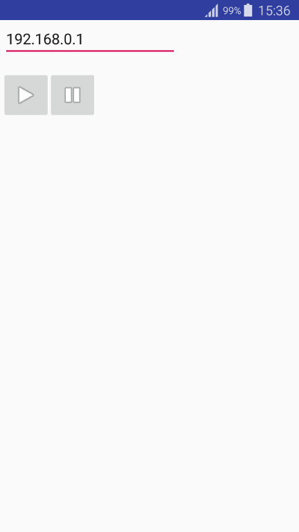

GStreamer Tutorial udpsink created using instructions posted on Stack Overflow by Eduardo Fernando. Variable `GSTREAMER_ROOT_ANDROID` must be defined in `/etc/profile` or `/home/USERNAME/.profile` and show to a path where you have extracted GStreamer Android binaries, for example: `export GSTREAMER_ROOT_ANDROID=/home/USERNAME/gstreamer-1.0-android-universal-1.14.2`
If you're having trouble building the project, download and unzip revision 10e of the NDK, set path pointing to it in your project's settings and copy file `source.properties` from the up-to-date NDK folder to folder containing the 10e version.
The app streams phone's main camera feed to a given IP address using openh264enc, default receiver's port number is 5000.

 - Create `local.properties` and add `sdk.dir` and `ndk.dir` properties:

```
  ndk.dir=~/Library/Android/android-sdk-linux/android-ndk-r10e
  sdk.dir=~/Library/Android/android-sdk-linux
```




To play the stream execute one of following commands on target machine:

```
gst-launch-1.0 udpsrc port=5000 ! h264parse ! avdec_h264 ! autovideosink
gst-launch-1.0 udpsrc port=5000 ! queue ! h264parse ! avdec_h264 ! queue ! videoscale ! video/x-raw,width=640,height=480 ! autovideosink
```
